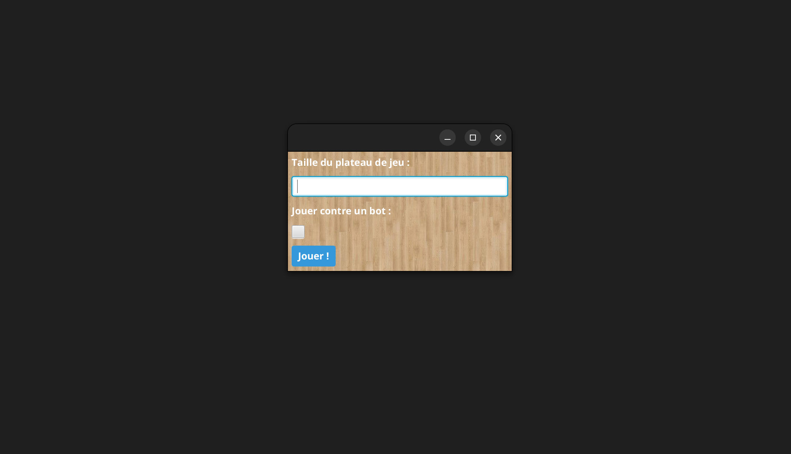
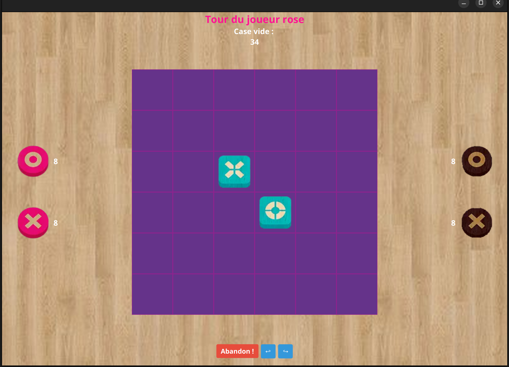
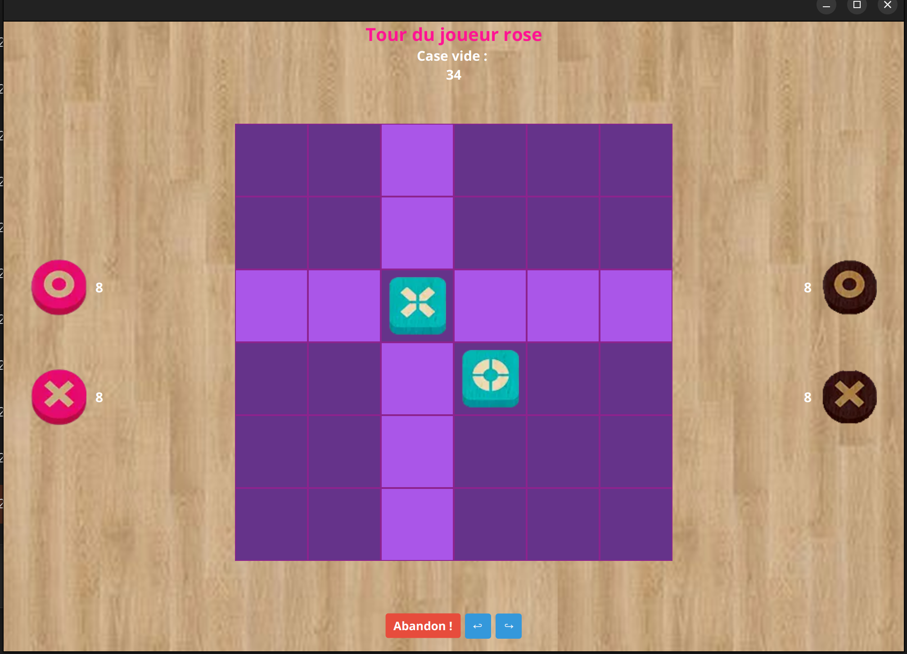
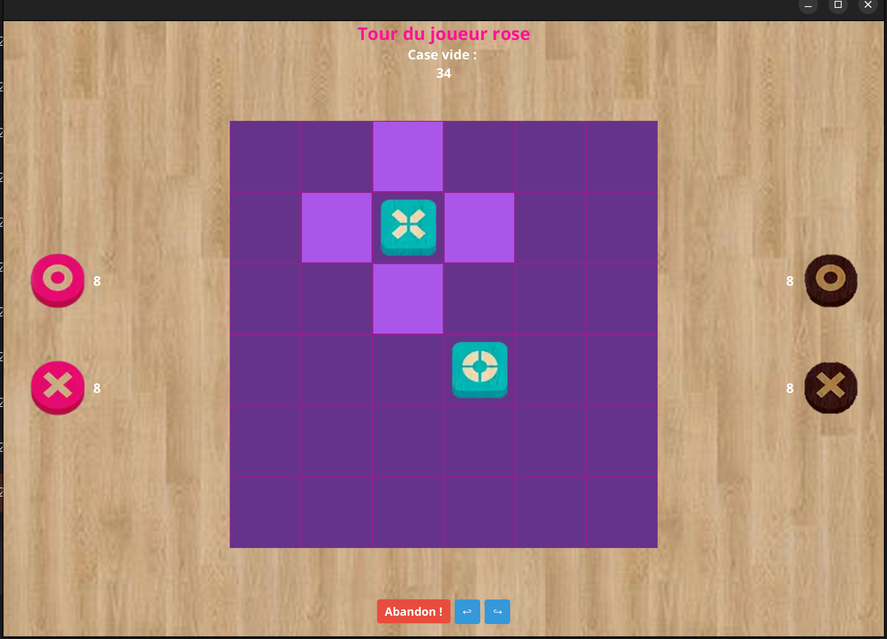
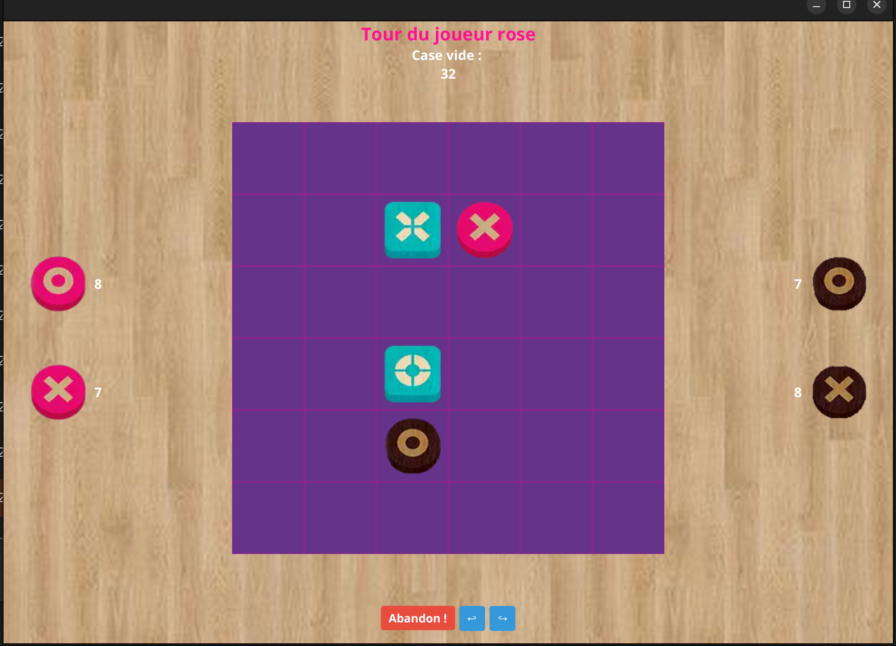
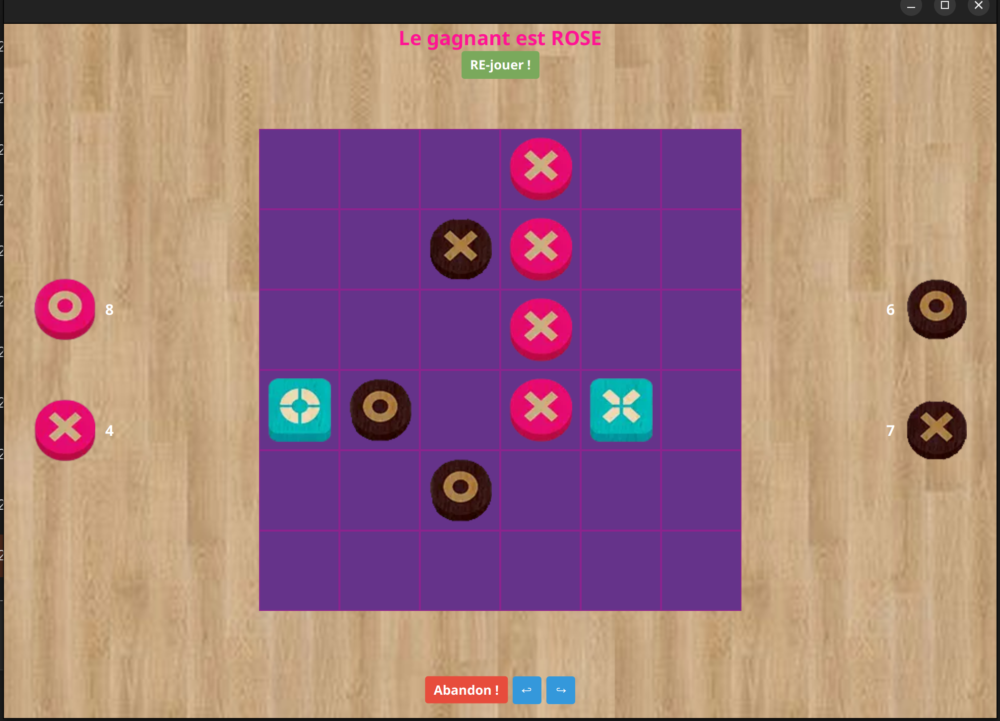

# Projet : Oxono 

## Description : 

The Oxono project, developed as part of our studies, taught us how to design and implement software using the **MVC architecture** along with key design patterns such as **Observer and Command** with javaFX. 
This project allowed us to better understand the principles of separation of concerns, event-driven communication, and command handling in a structured and maintainable way.

## Features :

- **MVC architecture** for clean separation of concerns
- **Undo/Redo** with design pattern Command
- **Observer**

## GamePlay :

## Launch : 

- mvn javafx:run

### Requirements
- Java 17+  
- Maven 3.8+  
- JavaFX SDK (if not using Maven dependencies)

